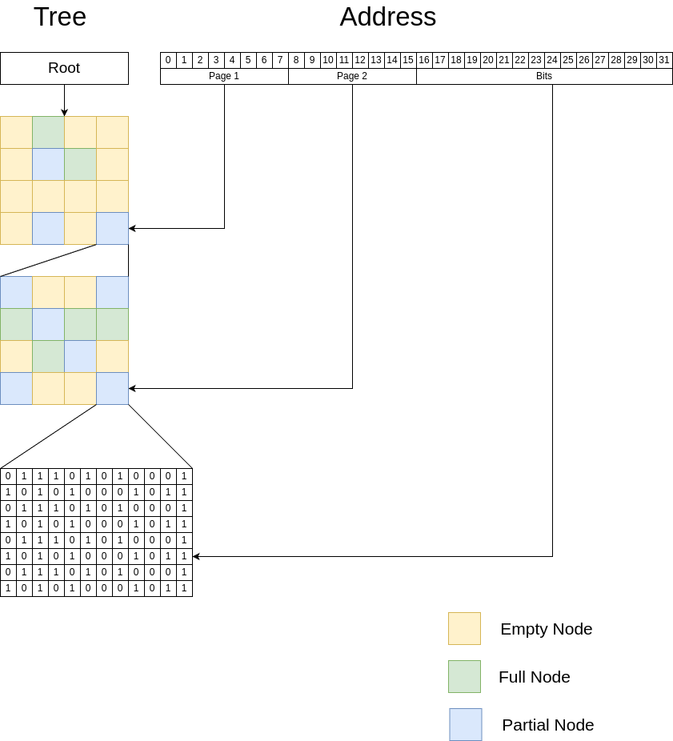

# Test assignment

## Task
You have a simple text file with IPv4 addresses. One line is one address, line by line:

```
145.67.23.4
8.34.5.23
89.54.3.124
89.54.3.124
3.45.71.5
...
```

The file is unlimited in size and can occupy tens and hundreds of gigabytes.

You should calculate the number of __unique addresses__ in this file using as little memory and time as possible.
There is a "naive" algorithm for solving this problem (read line by line, put lines into HashSet).
It's better if your implementation is more complicated and faster than this naive algorithm.

## Solution 

1. Represent each IP address as a bit in a bit array. So addresses are stored in structure similar to `BitSet`.
2. In order to save memory split array to chunks. Allocate chunk only when it is not full and is not empty. 
3. Store chunk information in a hierarchical, lazily-initialized structure 

This structure allows to reduce memory usage for small set. 

The picture illustrates address representation as `8+8+16`: 8 bits for first page address, 8 bit for next page address, 16 bit for bit address in a bit set.
This configuration is tunable, see [BitAddressConfiguration.kt](src/main/kotlin/me/vzhilin/job/ipcounter/BitAddressConfiguration.kt)

